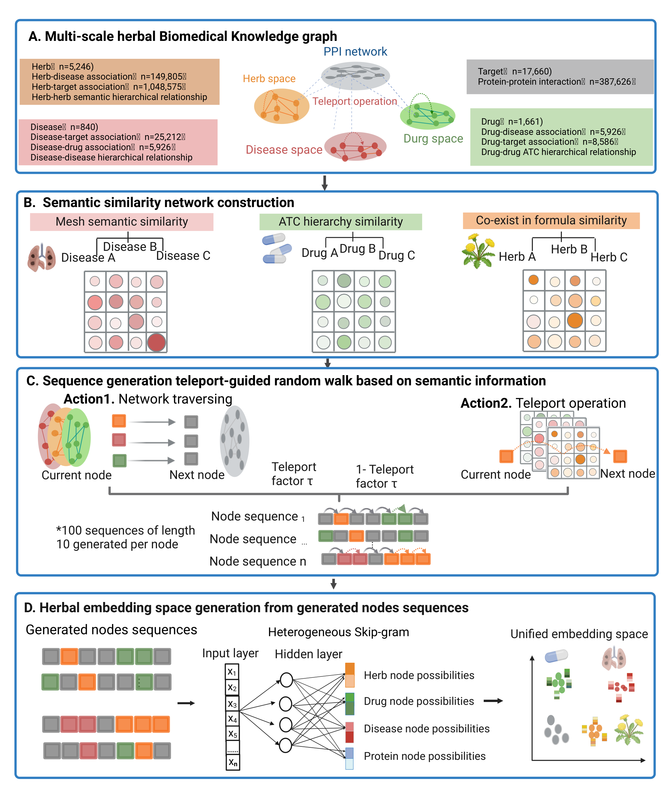

# HerbNetSpace: Bridging Herbal Medicine and Single-Drug Pharmacology through Biomedical Knowledge Graph Embedding

<p align="center">
  
  <br>
  <em>Figure 1. HerbNetSpace workflow: (a) Integrated BiomedKG construction, (b) Semantic similarity network creation, (c) Semantic-guided random walks, (d) Unified embedding learning</em>
</p>

## Overview
HerbNetSpace is an innovative biomedical knowledge graph (BiomedKG) embedding framework that bridges herbal medicine and conventional drug pharmacology through semantic-guided path analysis. Our framework enables systematic discovery of herb-drug-disease relationships by projecting 5,243 herbs, 1,661 drugs, and 840 diseases into a unified embedding space using:

- Semantic-guided graph learning
- Global protein interactome integration
- Hierarchical ontology analysis
- Clinical prescription pattern recognition

## Key Features
- **Comprehensive BiomedKG**: Integrates 5243 herbs, 1661 drugs, 840 diseases, and 17,660 genes
- **Multi-Relational Data**: 108k herb-target, 149k herb-disease, 755 drug-disease, 51k drug-gene, and 28k disease-gene associations
- **Semantic-Guided Learning**: Combines ATC codes, MeSH trees, and clinical co-occurrence patterns
- **Heterogeneous Embedding**: 256-dimensional embeddings capturing structural/functional relationships
- **Therapeutic Prediction**: Enables drug repurposing, combination therapy prediction, and mechanistic insights

## Installation
```bash
git clone https://github.com/yourusername/HerbNetSpace.git
cd HerbNetSpace
conda env create -f environment.yml
conda activate herbnetspace
